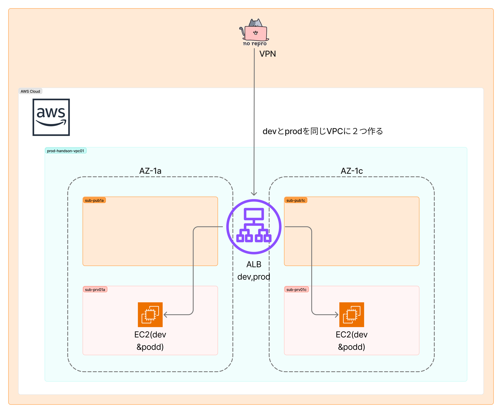

## 事前準備

### Terraform のインストール

まずは Terraform をインストールします。利用している OS ごとに、以下のコマンドをターミナルで実行してください。

(参考) https://developer.hashicorp.com/terraform/install

```bash
# macOS
# Homebrewを利用している場合は
brew tap hashicorp/tap
brew install hashicorp/tap/terraform
# していない場合は以下のURLからバイナリをダウンロードし、作業予定のフォルダに解凍してパスを通す
https://releases.hashicorp.com/terraform/1.12.1/terraform_1.12.1_darwin_arm64.zip


# Windows
# chocolateyを利用している場合は
choco install terraform
# していない場合は以下のURLからバイナリをダウンロードし、作業予定のフォルダに解凍してパスを通す
https://releases.hashicorp.com/terraform/1.12.1/terraform_1.12.1_windows_amd64.zip

# Amazon Linux
sudo yum install -y yum-utils shadow-utils
sudo yum-config-manager --add-repo https://rpm.releases.hashicorp.com/AmazonLinux/hashicorp.repo
sudo yum -y install terraform
```

### インストールの確認

インストールが完了したかを、次のコマンドで確認してみましょう。
エラーが出る場合は一度ターミナルを再起動し、解決しなければ講師を呼んでください。

```bash
terraform -help
```

### AWS のアクセスキー設定

次に、Terraform コマンドを通じて AWS を操作するためのアクセスキーを設定します。
本設定は**事務局側からご案内いただきます**ので、受け取った`アクセスキー`と`シークレットアクセスキー`をみなさまのターミナルで設定してください。

## Terraform ハンズオン

### ゴール目標

本ハンズオンのゴールは、Terraform で ALB + EC2(MAZ)を、開発環境、本番環境の 2 面作ることです。理解のために、ステップバイステップで進めましょう。



### 最小リソースの作成

EC2 を 1 台作成するコードを書いてみます。


まずは作業フォルダとファイルを作ります

```bash
mkdir terraform-handson
cd terraform-handson
touch main.tf
```

エディタで`main.tf`を開いてください。ここに Terraform のコードを書いていきましょう。

Terraform のコードは、非常にシンプルで、基本的に以下の見た目をしています。

```
<BLOCK TYPE> "<BLOCK LABEL>" "<BLOCK LABEL>" {
 # Block body
 <IDENTIFIER> = <EXPRESSION> # Argument
}
```

具体例を見てみます。`main.tf`に以下を書いて、実行してみましょう。

```terraform
terraform {
  required_providers {
    aws = {
      source  = "hashicorp/aws"
      version = "~> 5.0"
    }
  }
}

provider "aws" {
  region  = "ap-northeast-1"
}

data "aws_vpc" "vpc01" {
  filter {
    name   = "tag:Name"
    values = ["prod-handson-vpc01"]
  }
}

data "aws_subnet" "private-1a" {
  filter {
    name   = "tag:Name"
    values = ["prod-handson-vpc01-sub-prv01a"]
  }
}

resource "aws_instance" "app_server" {
  # ここにコードを調べながら書いてみましょう(画面投影で解説します)
  # https://registry.terraform.io/providers/hashicorp/aws/latest/docs/resources/instance.html

  subnet_id              = data.aws_subnet.private-1a.id
}
```

まず一番最初に、必要なプロバイダ(ここでは AWS)をインストールします。これは次のコマンドで実行できます。

```bash
terraform init
```

他にもサブコマンドがあり、コードのフォーマットや、文法チェックが出来ます。

```bash
terraform fmt
terraform validate
```

実行前に、構成に最終確認も出来ます。

```bash
terraform plan
```

Plan でエラーが出なければ、実際に適用してみてリソースを作成します。(途中の確認では、`yes`と小文字でタイプしてください)

```bash
terraform apply
```

Complete の表示が出たら、リソースの作成が完了です。AWS コンソール上でも確認してみましょう。

コンソール上で見ると、名前がついていないことが確認できます。


これでは不便なので、タグをつける変更を Terraform 経由で実行してみましょう。

```terraform
terraform {
  required_providers {
    aws = {
      source  = "hashicorp/aws"
      version = "~> 5.0"
    }
  }
}

provider "aws" {
  region  = "ap-northeast-1"
}

resource "aws_instance" "app_server" {
  # みなさまが書いたコードに、URLのドキュメントを参考にタグの設定を追記
  #   # https://registry.terraform.io/providers/hashicorp/aws/latest/docs/resources/instance.html
  
  subnet_id              = data.aws_subnet.private-1a.id
}
```

コード更新をしたら、再度実行します。

```terraform
terraform apply
```

再度コンソールで見ると、無事タグが反映されています。


終わったら、次のコマンドでリソースを削除します。

```bash
terraform destroy
```

### VPC を作成する

それでは、実用に近い構成を作っていきます。まずは VPC と関連リソースを作ります。


先ほどの`main.tf`の中身を**全て削除**し、以下のコードに置き換えて、`#変数定義`のセクションの`YOURNAME`となっているプレースホルダをご自身の名前に編集してください。(AWS の制限上、最大 8 文字程度でお願いします)

```terraform
# Provider設定
terraform {
  required_providers {
    aws = {
      source  = "hashicorp/aws"
      version = "~> 5.0"
    }

  }
}

provider "aws" {
  region = var.aws_region
}

# 使用可能なAZを取得
data "aws_availability_zones" "available" {
  state = "available"
}

# 変数定義
variable "aws_region" {
  description = "AWS region"
  type        = string
  default     = "ap-northeast-1"
}

variable "project_name" {
  description = "Project name for resource naming"
  type        = string
  default     = "handson-YOURNAME"
}
 

# VPC設定
data "aws_vpc" "vpc01" {
  filter {
    name   = "tag:Name"
    values = ["prod-handson-vpc01"]
  }
}
data "aws_subnet" "subnet-1a" {
  filter {
    name   = "tag:Name"
    values = ["prod-handson-vpc01-sub-pub01a"]
  }
}

data "aws_subnet" "subnet-1c" {
  filter {
    name   = "tag:Name"
    values = ["prod-handson-vpc01-sub-pub01c"]
  }
}

data "aws_subnet" "private-1a" {
  filter {
    name   = "tag:Name"
    values = ["prod-handson-vpc01-sub-prv01a"]
  }
}

data "aws_subnet" "private-1c" {
  filter {
    name   = "tag:Name"
    values = ["prod-handson-vpc01-sub-prv01c"]
  }
}

# 出力値
output "vpc_id" {
  description = "ID of the VPC"
  value       = data.aws_vpc.vpc01.id
}

output "subnet_id-1a" {
  description = "ID of the Subnet"
  value       = data.aws_subnet.subnet-1a.id
}

output "subnet_id-1c" {
  description = "ID of the Subnet"
  value       = data.aws_subnet.subnet-1c.id
}

output "private_id-1a" {
  description = "ID of the Subnet"
  value       = data.aws_subnet.private-1a.id
}

output "private_id-1c" {
  description = "ID of the Subnet"
  value       = data.aws_subnet.private-1c.id
}
```

コードを解説します。
概要を掴んだら、次のコマンドで実行してみてください。
コードにエラーがある場合は、`terraform plan`が出力するメッセージを読んで修正します。

```terraform
terraform plan
terraform apply
```

VPC とサブネットリソースが作成(連携)されました。

### EC2 を追加する

EC2 を MAZ 構成で追加します。


先ほどの`main.tf`の一番最後に、次のコードを **追記** してください。

```terraform
# 最新のAmazon Linux 2023 AMIを取得
data "aws_ami" "amazon_linux2023" {
  most_recent = true
  owners      = ["137112412989"]

  filter {
    name   = "name"
    values = ["al2023-ami-2023*-kernel-*-x86_64"]
  }

  filter {
    name   = "architecture"
    values = ["x86_64"]
  }

  filter {
    name   = "virtualization-type"
    values = ["hvm"]
  }
}

# セキュリティグループ
resource "aws_security_group" "ec2_sg" {
  name        = "${var.project_name}-ec2-sg"
  description = "Security group for EC2 instances"
  vpc_id      = data.aws_vpc.vpc01.id


#  ingress {
#    description = "HTTP"
#    from_port   = 80
#    to_port     = 80
#    protocol    = "tcp"
#    security_groups = [aws_security_group.alb_sg.id]
#  }

  egress {
    from_port   = 0
    to_port     = 0
    protocol    = "-1"
    cidr_blocks = ["0.0.0.0/0"]
  }

  tags = {
    Name = "${var.project_name}-ec2-sg"
  }
}

# EC2インスタンス - パブリックサブネット1
resource "aws_instance" "private_1" {
  ami                    = data.aws_ami.amazon_linux2023.id
  instance_type          = "t3.micro"
  subnet_id              = data.aws_subnet.private-1a.id
  vpc_security_group_ids = [aws_security_group.ec2_sg.id]
  user_data              = base64encode(local.nginx_userdata_1)

  tags = {
    Name = "${var.project_name}-ec2-private-1"
  }
}

# EC2インスタンス - パブリックサブネット2
resource "aws_instance" "private_2" {
  ami                    = data.aws_ami.amazon_linux2023.id
  instance_type          = "t3.micro"
  subnet_id              = data.aws_subnet.private-1c.id
  vpc_security_group_ids = [aws_security_group.ec2_sg.id]
  user_data              = base64encode(local.nginx_userdata_2)

  tags = {
    Name = "${var.project_name}-ec2-private-2"
  }
}


# Nginx起動用userdata script
locals {
  nginx_userdata_1 = <<-EOF
    #!/bin/bash
    dnf update -y
    dnf install -y nginx
    systemctl enable nginx
    systemctl start nginx
    sed -i 's/x!/x!-01/g' /usr/share/nginx/html/index.html
  EOF

  nginx_userdata_2 = <<-EOF
    #!/bin/bash
    dnf update -y
    dnf install -y nginx
    systemctl enable nginx
    systemctl start nginx
    sed -i 's/x!/x!-02/g' /usr/share/nginx/html/index.html

  EOF
}

# EC2インスタンスのIPアドレスを出力
output "ec2_public_1_public_ip" {
  description = "Public IP of EC2 instance in public subnet 1"
  value       = aws_instance.public_1.public_ip
}

output "ec2_public_2_public_ip" {
  description = "Public IP of EC2 instance in public subnet 2"
  value       = aws_instance.public_2.public_ip
}
```

 
同様に解説します。概要が掴めたら、以下のコマンドで実行してください。

```terraform
terraform plan
terraform apply
```

コードの前半には先ほどの VPC リソースが記載されていますが、そのまま実行しても追加分の EC2 だけ適切にリソースが作成されます。これは、Terraform が宣言的なコード記述ができる特性が現れていて、Day2 運用、構成変更に対しての利点となります。

### ALB を追加する

EC2 の手前に ALB を追加します。


同様に、`main.tf`の最後に **追記** してください。

```terraform
# ALB用セキュリティグループ
resource "aws_security_group" "alb_sg" {
  name        = "${var.project_name}-alb-sg"
  description = "Security group for ALB"
  vpc_id      = data.aws_vpc.vpc01.id

  ingress {
    description = "HTTP"
    from_port   = 80
    to_port     = 80
    protocol    = "tcp"
    cidr_blocks = ["x.x.x.x/0"]
  }

  egress {
    from_port   = 0
    to_port     = 0
    protocol    = "-1"
    cidr_blocks = ["0.0.0.0/0"]
  }

  tags = {
    Name = "${var.project_name}-alb-sg"
  }
}

# Application Load Balancer
resource "aws_lb" "main" {
  name               = "${var.project_name}-alb"
  internal           = false
  load_balancer_type = "application"
  security_groups    = [aws_security_group.alb_sg.id]
  subnets            = [data.aws_subnet.subnet-1a.id, data.aws_subnet.subnet-1c.id]

  enable_deletion_protection = false

  tags = {
    Name = "${var.project_name}-alb"
  }
}

# ターゲットグループ
resource "aws_lb_target_group" "main" {
  name     = "${var.project_name}-tg"
  port     = 80
  protocol = "HTTP"
  vpc_id   = data.aws_vpc.vpc01.id

  health_check {
    enabled             = true
    healthy_threshold   = 2
    interval            = 30
    matcher             = "200"
    path                = "/"
    port                = "traffic-port"
    protocol            = "HTTP"
    timeout             = 5
    unhealthy_threshold = 2
  }

  tags = {
    Name = "${var.project_name}-tg"
  }
}

# ターゲットグループにEC2インスタンスを登録
resource "aws_lb_target_group_attachment" "public_1" {
  target_group_arn = aws_lb_target_group.main.arn
  target_id        = aws_instance.private_1.id
  port             = 80
}

resource "aws_lb_target_group_attachment" "public_2" {
  target_group_arn = aws_lb_target_group.main.arn
  target_id        = aws_instance.private_2.id
  port             = 80
}

# ALBリスナー
resource "aws_lb_listener" "main" {
  load_balancer_arn = aws_lb.main.arn
  port              = "80"
  protocol          = "HTTP"

  default_action {
    type             = "forward"
    target_group_arn = aws_lb_target_group.main.arn
  }
}

# ALBのDNS名を出力
output "alb_dns_name" {
  description = "DNS name of the load balancer"
  value       = aws_lb.main.dns_name
}
```

同様に解説します。
作成が完了し、ALB の DNS 名が出力されたらブラウザからアクセスしてみてください。
リロードを何回か繰り返すと、EC2 にラウンドロビンされている様子がわかると思います。

次の準備のために、環境を削除しましょう。少し環境が複雑になってきましたが、IaC では環境の削除も容易です。

```terraform
terraform destroy
```

### 開発環境、本番環境をそれぞれ作る

最後に、この Terraform のコードを使って、本番と開発環境を作ってみましょう。冒頭に示した、最終ゴールです。


devフォルダ、prodフォルダを作成し、それぞれのフォルダにmain.tfをコピーします。また`variables.tf`, `dev.tfvars`, `prod.tfvars`の 3 ファイルを作成し、`variables.tf`はそれぞれのフォルダにコピー, `dev.tfvars`, `prod.tfvars`は片方のフォルダにコピーします。

```terraform
# variables.tf
variable "environment" {
  description = "Environment name (dev, prod)"
  type        = string
}
```

```terraform
# dev.tfvars
environment    = "dev"
```

```terraform
# dev.tfvars
environment    = "prod"
```

次に、`main.tf`を編集します。お使いのエディタの機能で、`${var.project_name}`となっている箇所を、`${var.project_name}-${var.environment}`と全て置換してください。手動でも大丈夫です。全部で 10 箇所あります。

終わりましたら、次のコマンドを実行して開発環境を作成します

```terraform
terraform plan -var-file="dev.tfvars"
terraform apply -var-file="dev.tfvars"
```

次に、本番環境を作成します

```terraform
terraform plan -var-file="prod.tfvars"
terraform apply -var-file="prod.tfvars"
```

コンソールから見ると、それぞれ開発と本番環境が分離して作成されていることが確認できます。このように、変数やコードを再利用性のある形で相互利用することにより、容易に環境の用意と削除が実行できます。

> [!TIP]
> これまでのコードの最終形が、`/src`フォルダ配下にあります。うまく動作しない方は、参考にしてみてください。

確認できたら、環境を削除します。

```terraform
terraform destroy -var-file="dev.tfvars"
terraform destroy -var-file="prod.tfvars"
```

## Terraform のクラウド版

今回利用したコミュニティ版以外にも、様々な機能が追加されたクラウド版があります。どのように利用できるか、投影のみになりますがご紹介します。

## 片付け

### 作成したリソースの削除

(まだの場合は)`terraform apply`を実行した各フォルダで`terraform destroy`を実行します